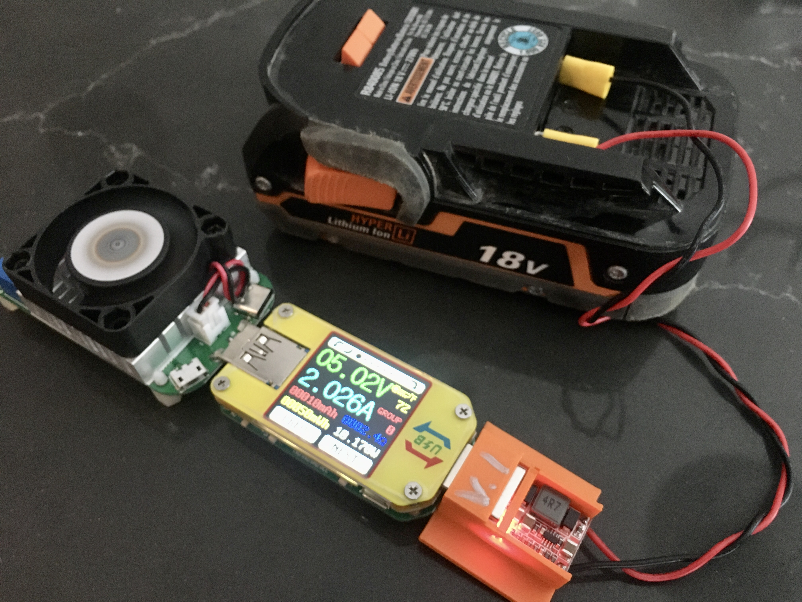
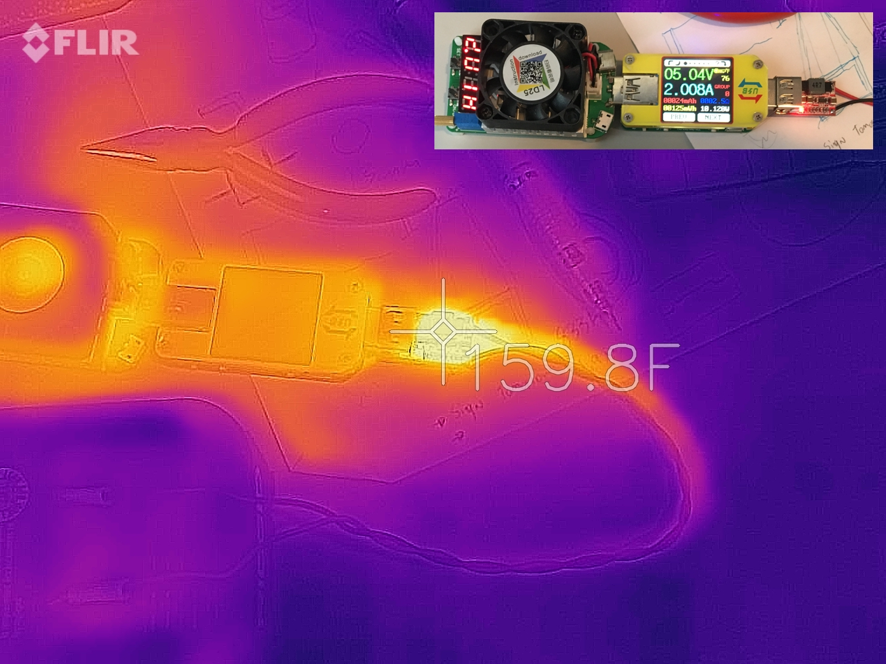

# DC/DC Buck Converter

This is a holder for [HiLetgo 5pcs DC-DC Buck Step Down Module 6-24V 12V/24V to 5V 3A USB Charger Module](https://www.amazon.com/gp/product/B01HXU1C6U/ref=ppx_yo_dt_b_asin_title_o00_s00?ie=UTF8&psc=1).

The part is meant to be embedded into other parts.

## Heat Test

Ran converter for 2 hours with room ambient temperature at 73°F. Peak temp of converter was 160°F.

