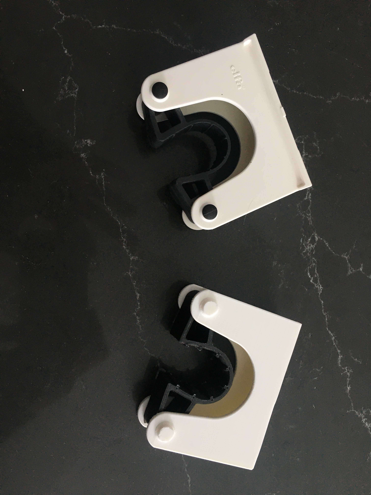
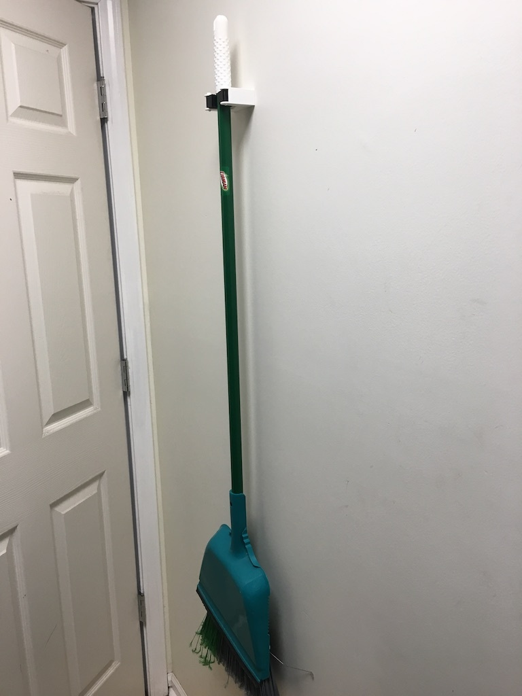

See how it was drawn on YouTube:

# Tool Hanger

This is a tool hanger that is similar to [`Elfa Utility Tool Holders`](https://elfa.com/en/assortment/laundry-and-cleaning/toolholder) but you can screw it directly to the wall instead of using the small track.

## To Print

* Print all the parts in ridged material like ABS or PLA
* Print `Friction Hanger_Friction Lock` in flexible material like TPU-95
