# Amazon Echo Power from Ridgid Battery

Build power source for Amazon Echo using a standard Ridgid power tool battery. Unit needs to be able to be used outdoors on warm summer days.

## Parts

* DC/DC 18v to 5V USB - [Buck Converter](https://www.amazon.com/dp/B01HXU1C6U/ref=pe_1098610_137717230_cm_rv_eml_rv0_dp)
* 3D print using PETG

## Log

---

Dec 27 2020  

Made some spare battery holders for the shop

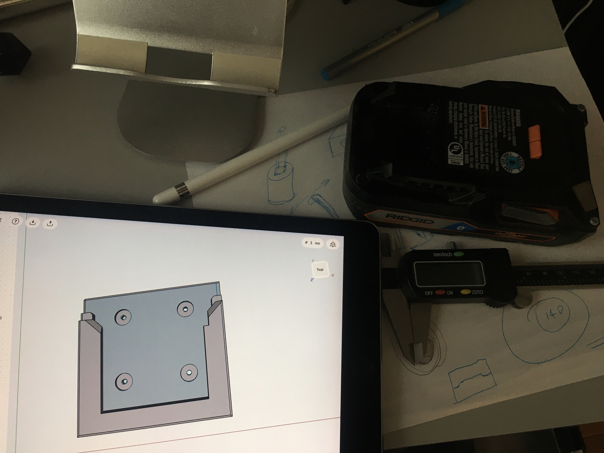
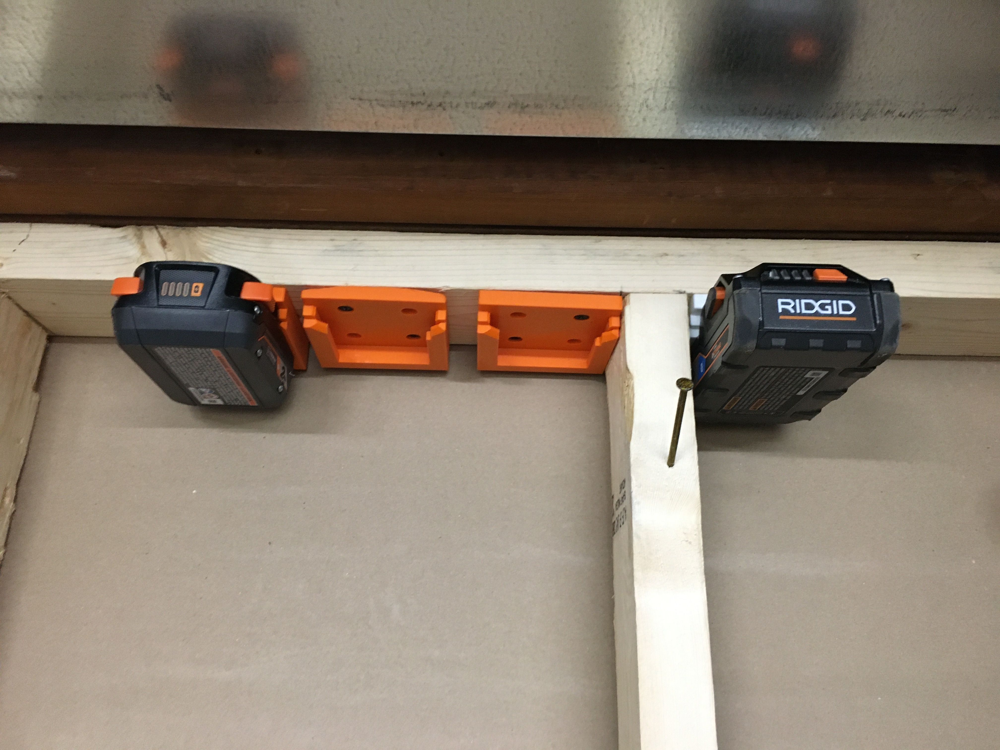
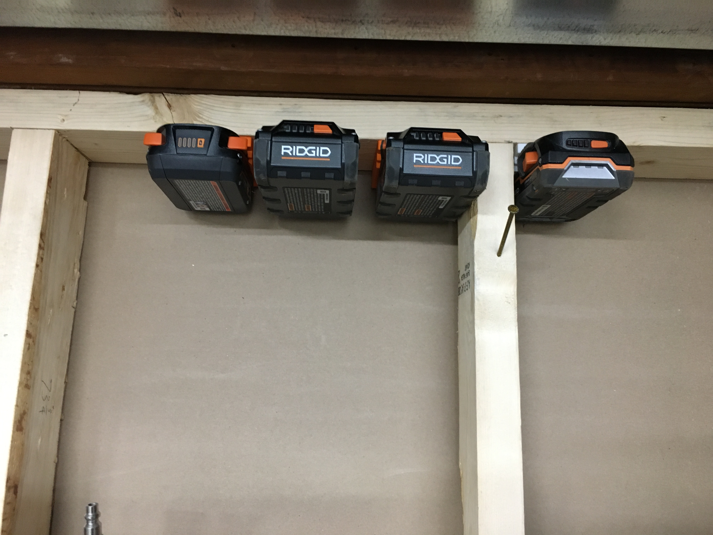

---

Dec 29 2020  

Got buck convert from Amazon. Soldered on some wires and connectors and did some initial testing.

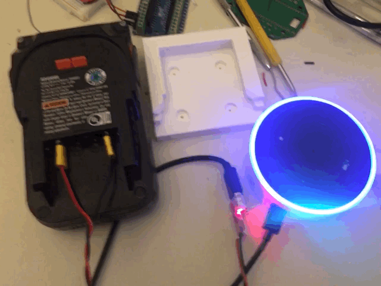

--- 

Dec 30 2020  

Tried various buck converter fixture holders.

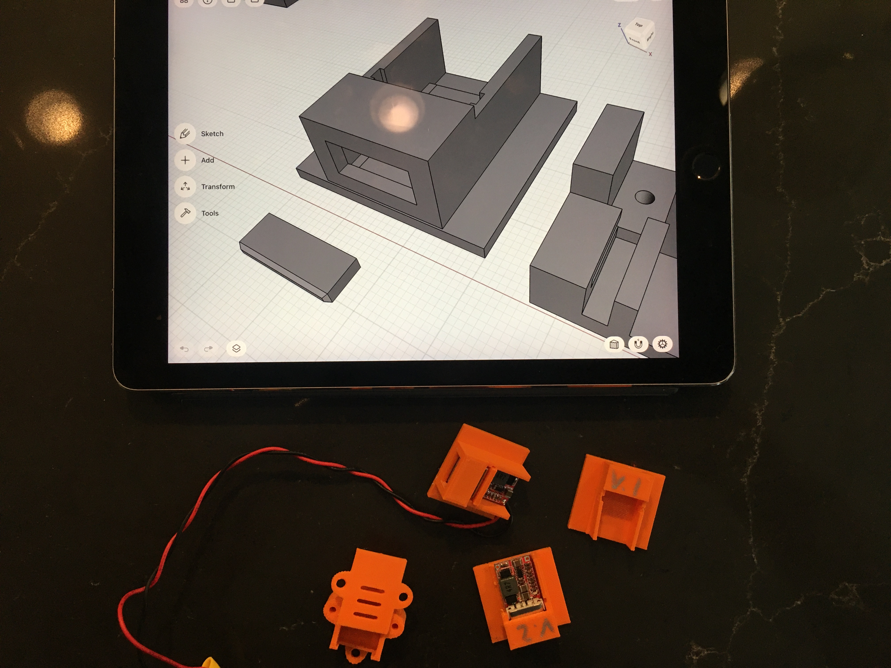

---

Dec 31 2020  

Did thermal testing of buck converter under 4x of expected load.

**Test Setup**

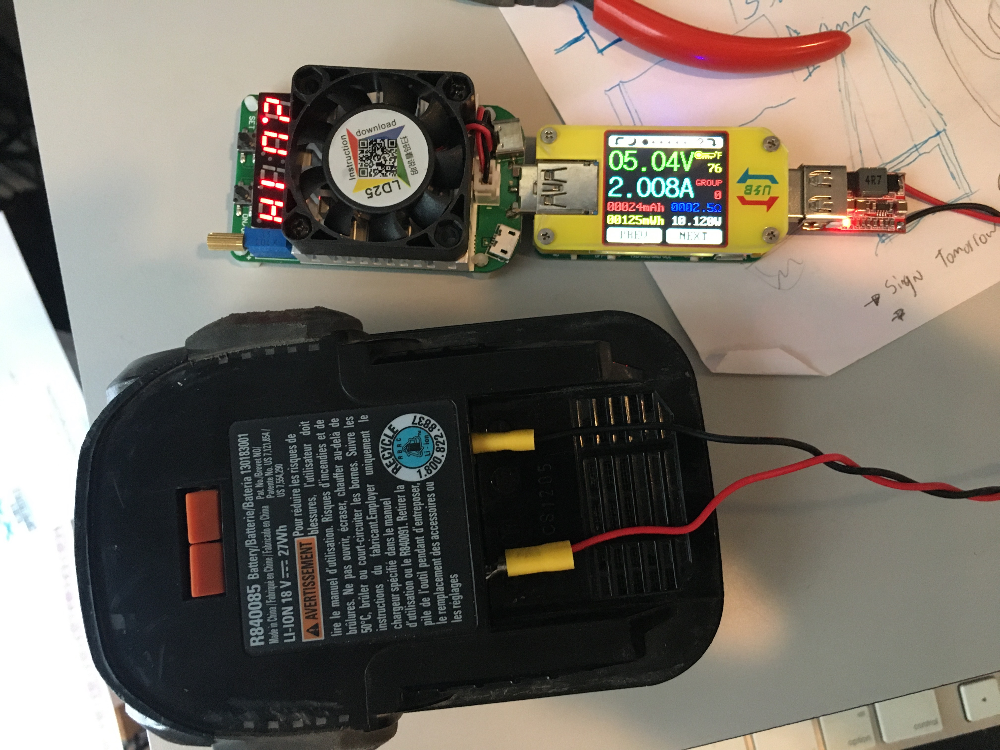

**2.5 Amps**

Unit gets very hot under this load (244°F)

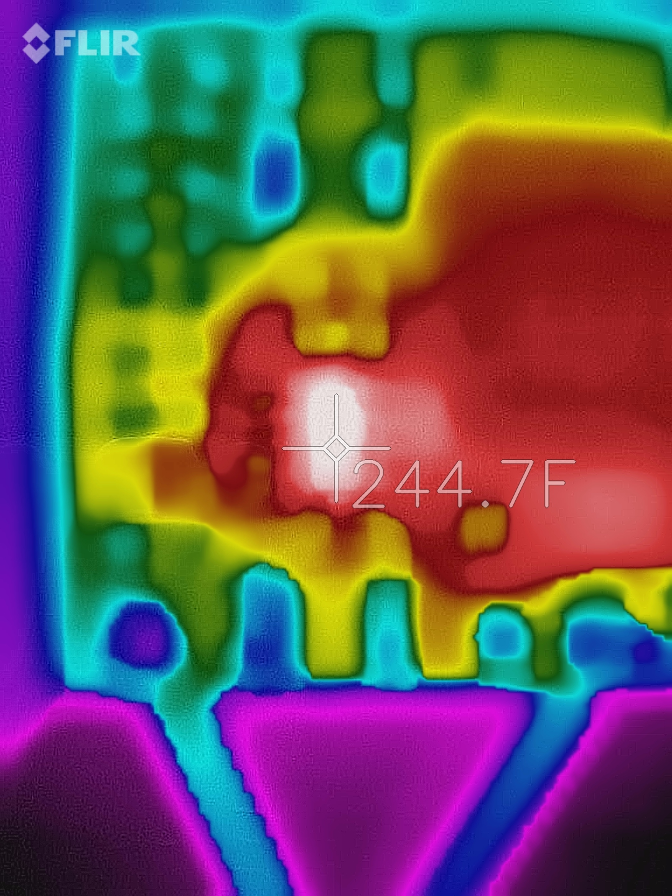

---

Jan 1 2021  

Worked on pressure fit battery connector. Tried lots of different methods to slide connect batter to thermals.

Initial was using steel endocarps from crescent rolls cans. But generally the metal was too then to hold the shape needed

Finally ended up with slots in part and folded up paper clip and a screw to hold it together

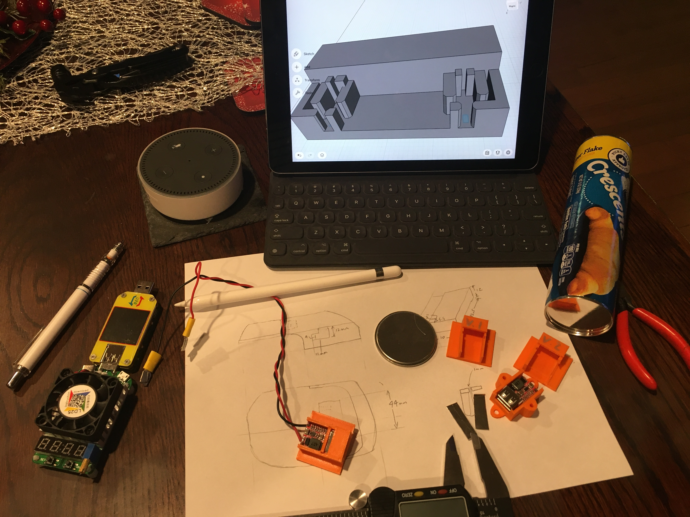
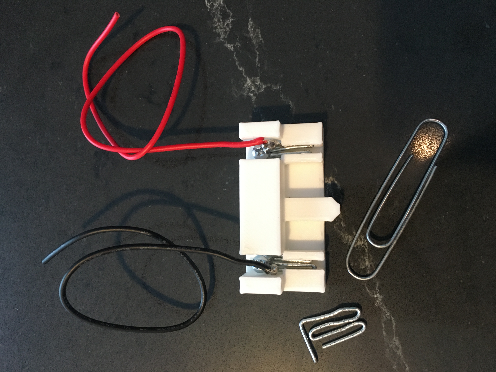

Did more thermal testing under expected load + 15%. Unit stayed fairly cool at 108°F

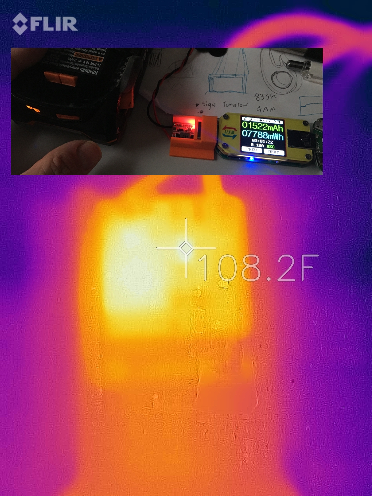

---

Jan 2 2021  

Working on merging Buck Converter and Battery Clip into single unit.

Start preparing print bed for PETG printing

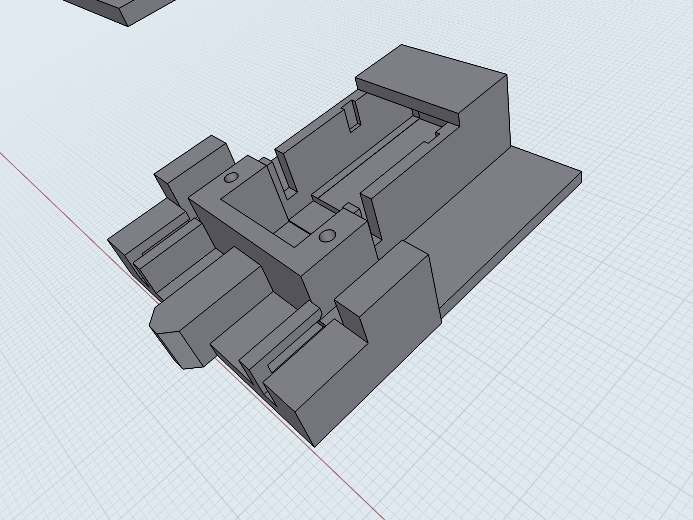