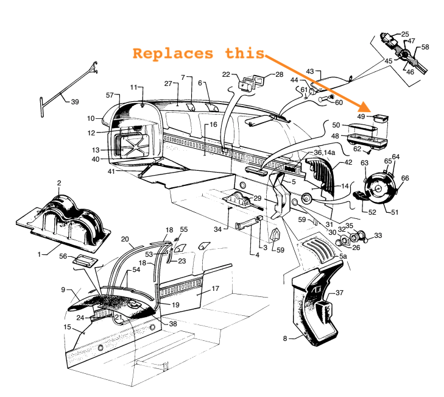
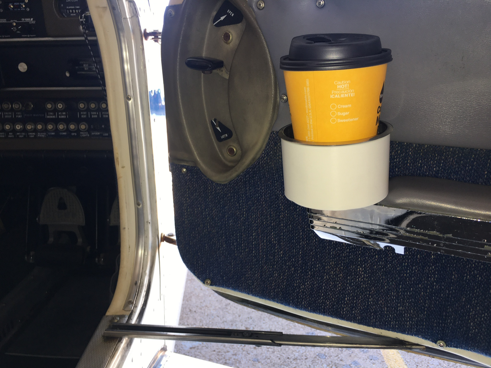
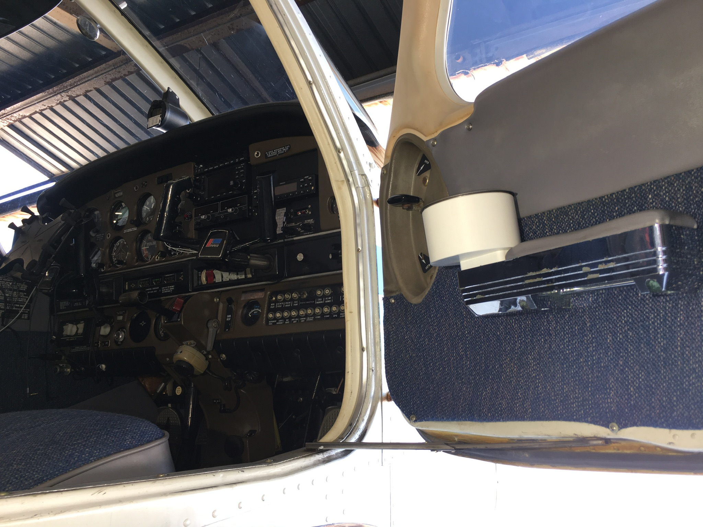
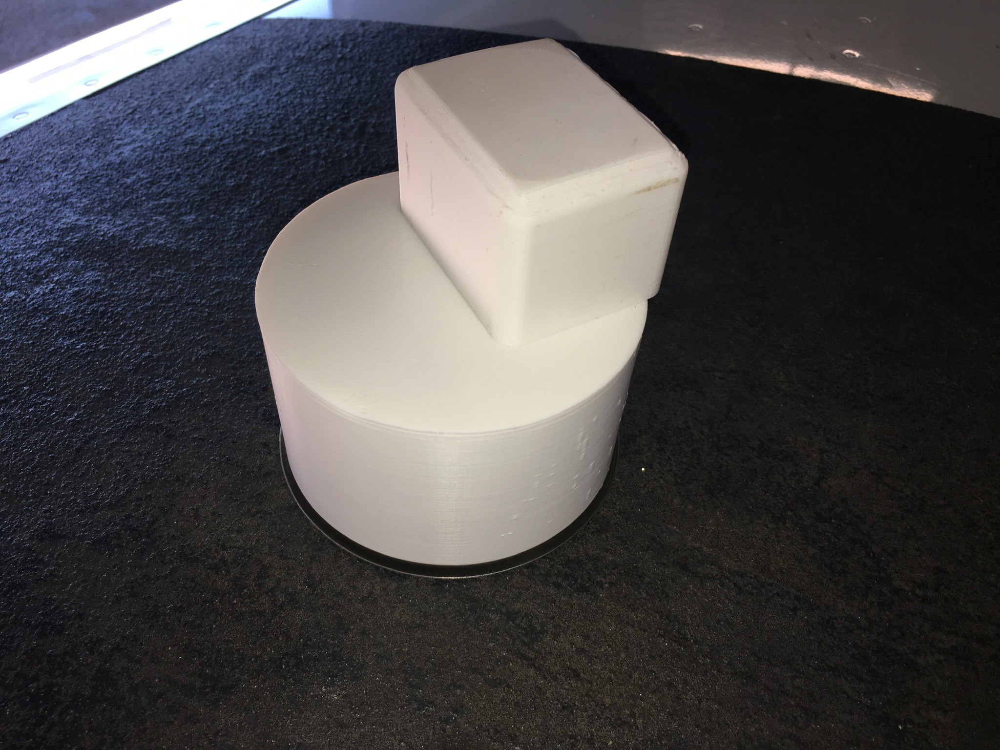

# Ash Tray Cup Holder

* [Stainless Steel Cup Holder Inserts](https://www.amazon.com/gp/product/B0789HG6NW/ref=ppx_yo_dt_b_asin_title_o04_s00?ie=UTF8&psc=1)
* [Cork Coaster](https://www.amazon.com/Self-Adhesive-Cork-Circle-50-Pack-Coasters/dp/B07BS6ZNWQ/ref=sr_1_6?dchild=1&keywords=3.5%22+cork+coaster&qid=1592659625&sr=8-6)

For adding a cup holder I did not want to screw anything to my side panels or into to the plane. So I designed this part to fit in the existing ashtray.

**Design Notes and Assembly**

I broke this design into two part so it is much easier and faster to print and not require any support material. The part is printed with "pre-drilled" and counter sunk holes to align the part for assembly. The pre-drill is added so the infill can be set really low but you will still get a lot of material around the screw threads (in theory). I added super glue to the joint just for added security but that is probably overkill.

## Images

## Alternative Mounting Options

* [Camco Adjustable Drink Holder- Can Hold Mugs, Large Drinks and Almost Any Size Bottle or Can, Make Great Extra Cupholders for Cars, Trucks, RVs, Vans, Boats and Much More - Black (44044)](https://www.amazon.com/Camco-44044-Adjustable-Drink-Holder/dp/B000EDQR4G/ref=pd_ybh_a_59?_encoding=UTF8&psc=1&refRID=Q1GN1TENFPCTZXHBMSFV)
* [Fischer Premium Folding Universal fit auto car Truck Boat Drink Cup Holder cupholder Mercedes E320](https://www.amazon.com/Fischer-Premium-Universal-cupholder-Mercedes/dp/B07P5HZRVF/ref=pd_ybh_a_60?_encoding=UTF8&psc=1&refRID=Q1GN1TENFPCTZXHBMSFV)