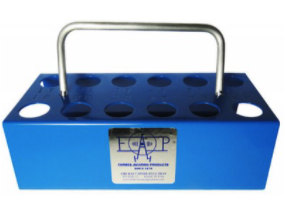
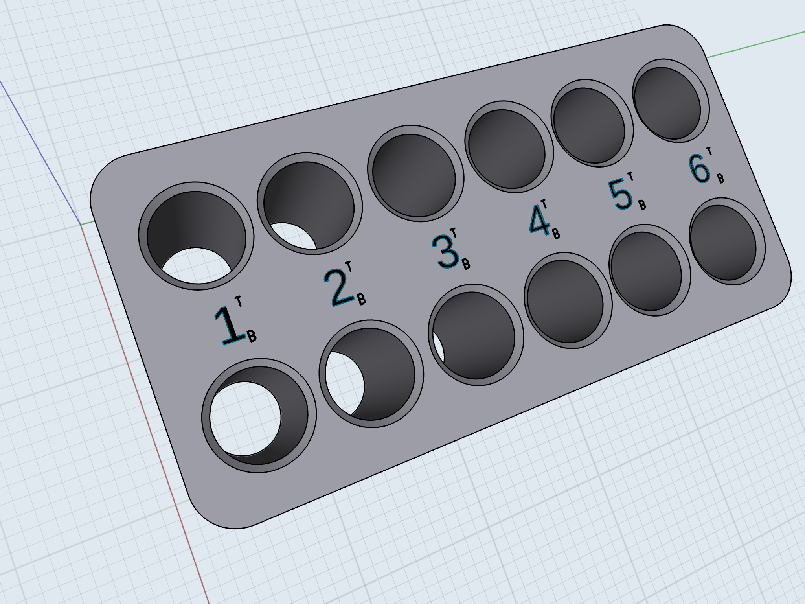

# SPARK PLUG TRAY

* Based On 

This tray holds 12 spark plugs each hole stamped with cylinder number and also marked (T) top and (B) bottom so each plug can be identified easily, no mix-ups. Plugs can be serviced and returned back to where they were removed. This is a must for aircraft mechanics.

Made from 18 gauge steel.
Blue powder coat finish.
Dimensions: W4.0", L8.0", H2.6.

