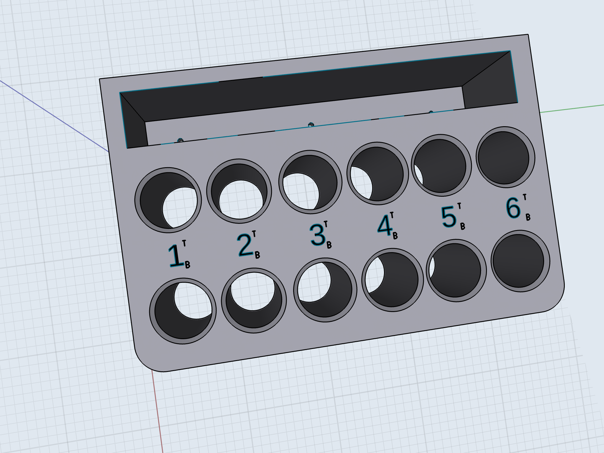

# SPARK PLUG TRAY

This tray holds 12 spark plugs each hole stamped with cylinder number and also marked (T) top and (B) bottom so each plug can be identified easily, no mix-ups. Plugs can be serviced and returned back to where they were removed. This is a must for aircraft mechanics.

Made from 18 gauge steel.
Blue powder coat finish.
Dimensions: W4.0", L8.0", H2.6.

* This design is based on Based On [Plug-A-Long Spark Plug Tray](https://www.aircraftspruce.com/catalog/topages/plugalong.php#productMainImage)

Same thing but with slot to put rappers and gauges

## Other Designs

* [Aircraft Spark Plug Tray](https://www.thingiverse.com/thing:3587648)
* [Aviation Spark Plug Case](https://www.thingiverse.com/thing:3677959)
* [6-Cylinder ContiLyc Spark Plug Holder with Travy](https://www.thingiverse.com/thing:4618692)
* kitplanes.com notes on how to make your own [here](https://www.kitplanes.com/engine-beat-56/)